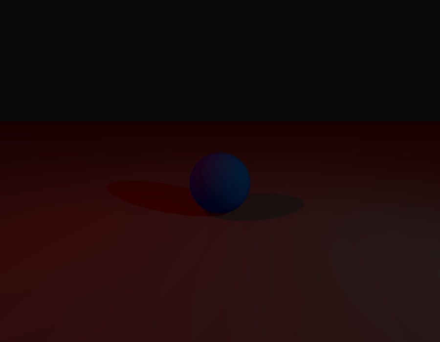
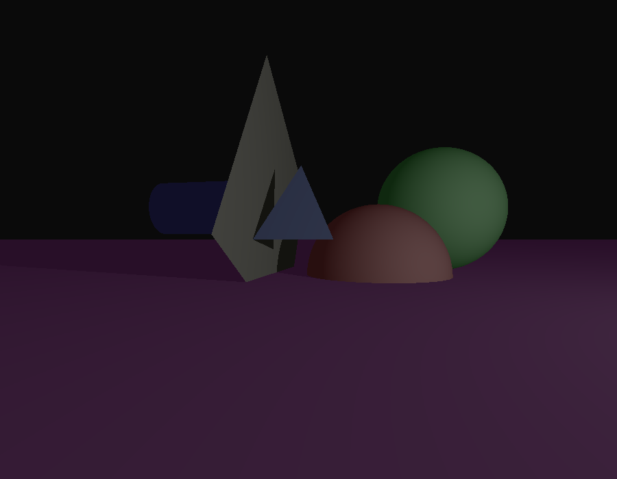

# miniRT

A minimal raytracing engine writtent in C and MiniLibX. It renders primitive polygons like spheres, planes, squares, triangles and cylinders. It also handles multiple light sources and cameras.

### How to Run It

* ``git clone --recurse-submodules https://github.com/Kernunn/miniRT.git``
* ``cd minilibx-linux`` and check Readme
* install additional libraries and do ``make && ./test/run_tests.sh``
* ``cd ..; make``

### Usage

+ `./miniRT <scene.rt>` To render the .rt scene passed as a parameter

+ `./miniRT <scene.rt> --save` To save the .rt scene passed as a parameter to a .bmp file

You can use one of the examples located in the scenes folder, or write your own. If you wish to save your render as a bitmap file, add --save after the file name.  

If your scene contains multiple cameras, use the arrow keys to iterate through them on your rendered scene.

### Example

